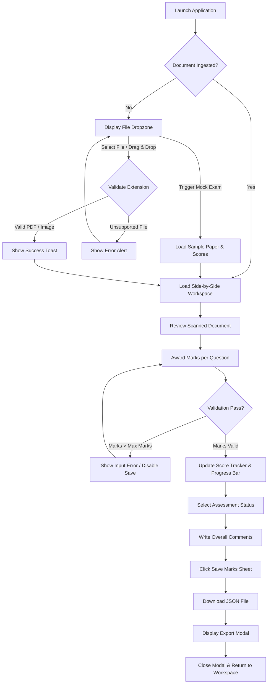
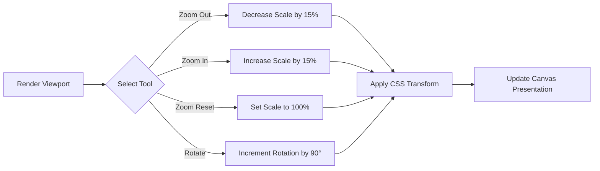

# AuraMark OSM — UI & Design Architecture Document

This document provides a comprehensive review of the user interface (UI) and user experience (UX) architecture of the **AuraMark OSM (On-Screen Evaluation Suite)** project. It details the existing design system, layout hierarchy, responsive strategies, accessibility standing, and concludes with professional product design recommendations, benchmark scores, and a prioritized improvement roadmap.

---

## Table of Contents
1. [Product Overview](#1-product-overview)
2. [Design System](#2-design-system)
   - 2.1 [Color Palette](#21-color-palette)
   - 2.2 [Typography](#22-typography)
   - 2.3 [Spacing & Layout Tokens](#23-spacing--layout-tokens)
   - 2.4 [Buttons & Interactive Elements](#24-buttons--interactive-elements)
   - 2.5 [Cards & Elevation](#25-cards--elevation)
   - 2.6 [Forms & Inputs](#26-forms--inputs)
   - 2.7 [Icons](#27-icons)
   - 2.8 [Navigation & Modals](#28-navigation--modals)
   - 2.9 [Notifications & Feedback](#29-notifications--feedback)
3. [Screen-by-Screen UI Breakdown](#3-screen-by-screen-ui-breakdown)
   - 3.1 [Document Upload (Dropzone) Screen](#31-document-upload-dropzone-screen)
   - 3.2 [Evaluation Workspace Screen](#32-evaluation-workspace-screen)
   - 3.3 [Saved Data Modal Screen](#33-saved-data-modal-screen)
4. [Layout Structure & Component Hierarchy](#4-layout-structure--component-hierarchy)
5. [User Flows (Mermaid Diagrams)](#5-user-flows-mermaid-diagrams)
6. [Responsive Design Strategy](#6-responsive-design-strategy)
7. [Visual Hierarchy Analysis](#7-visual-hierarchy-analysis)
8. [Accessibility (a11y) Review & WCAG Contrast Audit](#8-accessibility-a11y-review--wcag-contrast-audit)
9. [Reusable Component Documentation](#9-reusable-component-documentation)
10. [Design Consistency Analysis](#10-design-consistency-analysis)
11. [Senior Product Designer UI/UX Suggestions](#11-senior-product-designer-uiux-suggestions)
12. [ChatGPT Design Review & Benchmarking](#12-chatgpt-design-review--benchmarking)
13. [Prioritized Roadmap (Quick Wins, Medium Effort, Long-Term)](#13-prioritized-roadmap-quick-wins-medium-effort-long-term)

---

## 1. Product Overview
**AuraMark OSM** is an On-Screen Evaluation/Marking suite designed to digitize assessment grading. It bridges the gap between physical examinations and digital tracking by allowing evaluators (such as examiners or professors) to review scanned paper submissions (either in PDF or image format) alongside a granular question-by-question grading panel. 

The product's primary goals are:
* **Workflow Acceleration**: Minimizing screen-switching by placing document view and grading inputs side-by-side.
* **Accuracy Assurance**: Preventing out-of-bounds score entries via client-side input validations.
* **Data Portability**: Enabling the export of structured evaluation summaries as standard JSON schemas suitable for downstream relational databases.

---

## 2. Design System

### 2.1 Color Palette
AuraMark OSM adopts a corporate-inspired light-theme aesthetic dominated by functional blues, clean grays, and contextual state indicators.

#### Brand Colors
* **Primary Brand / Interactive**: `#2563EB` (Blue 600) — used for primary call-to-actions, focused outlines, and progress tracking.
* **Primary Hover**: `#1D4ED8` (Blue 700) — dark blue color for button hover states.
* **Secondary Brand / Dark Accents**: `#0F172A` (Slate 900) — applied to main headlines, dark text focus, and code blocks.
* **Base Background**: `#F8FAFC` (Slate 50) — neutral, cool-tinted canvas background to reduce screen eye strain.
* **Card & Surface Backgrounds**: `#FFFFFF` (White) — high contrast content container surfaces.
* **Borders / Separators**: `#E5E7EB` (Gray 200) — light dividers separating UI zones.

#### Contextual Colors
* **Text (Primary)**: `#111827` (Gray 900) — optimized for body copy legibility.
* **Text (Muted/Secondary)**: `#6B7280` (Gray 500) — descriptions, labels, and placeholders.
* **Success**: `#16A34A` (Green 600) — success badges, progress indicators, and successfully graded rows.
* **Warning**: `#F59E0B` (Amber 500) — intermediate/draft statuses.
* **Danger**: `#DC2626` (Red 600) — input validation errors and delete actions.

---

### 2.2 Typography
The design relies on the **Inter** font family, optimized for on-screen legibility and high information density.

| Role | Font Size / Weight | Tailwind Class | Primary Color |
|---|---|---|---|
| Page Branding | 14px / Extrabold (800) | `text-sm font-extrabold` | `#111827` (Gray 900) |
| App Subtitle | 10px / Semibold (600) | `text-[10px] font-semibold` | `#9CA3AF` (Gray 400) |
| Main Headings | 20px / Bold (700) | `text-xl font-bold` | `#111827` (Gray 900) |
| Card Headings | 14px / Bold (700) | `text-sm font-bold` | `#111827` (Gray 900) |
| Section Sub-headings | 10px / Bold (700) | `text-[10px] font-bold uppercase` | `#9CA3AF` (Gray 400) |
| Body & Inputs | 14px / Medium (500) | `text-sm font-medium` | `#111827` / `#6B7280` |
| Micro Copy / Errors | 10px or 11px / Bold (700) | `text-[10px]/[11px] font-bold` | `#DC2626` / `#6B7280` |
| Raw Data Display | 12px / Monospace | `text-xs font-mono` | `#22C55E` (Green 400) |

---

### 2.3 Spacing & Layout Tokens
Spacing is established using Tailwind's multiplier scale:
* `gap-1` / `gap-1.5` (4px / 6px) — Micro-spacing for labels, inline badges, and buttons containing icons.
* `gap-2` / `gap-2.5` (8px / 10px) — Small gaps between adjacent fields or structural controls.
* `p-3` / `p-3.5` (12px / 14px) — Content cell paddings within lists and individual question cards.
* `p-4` / `p-5` (16px / 20px) — Padding applied to sidebars, toolbars, and global grid layouts.
* `p-6` / `p-8` / `p-12` (24px / 32px / 48px) — Section containers, dropzones, and modal wrappers.

---

### 2.4 Buttons & Interactive Elements
Interactive buttons utilize hover transitions and dynamic visual states:

1. **Primary Button** (`bg-blue-600`): Full blue background, bold white text, rounded corners (`rounded-xl`). Hover transition shifts background to `bg-blue-700` and adds a subtle shadow. Active click is supported by a scale-down animation (`active:scale-[0.98]`).
2. **Secondary Button (Outlined)** (`bg-white border-gray-200`): White background, gray borders, semibold text. Shifts to a light gray background (`bg-gray-50`) on hover.
3. **Accent Button (Add Q)** (`bg-blue-600`): Small footprint action button utilizing bold white text and a smaller corner radius (`rounded-lg`).
4. **Ghost Action Icon Button** (`bg-transparent`): Bare icon buttons (e.g., zoom in/out, rotate). Shifts to `bg-gray-100` on hover.
5. **Destructive Icon Button** (`text-gray-300`): Delete trash cans that transition to bright red (`text-red-500 bg-red-50`) when targeted.

---

### 2.5 Cards & Elevation
Surface containers utilize distinct border-radii and shadows to indicate hierarchy:
* **Upload Card**: `rounded-2xl` with a dashed border (`border-2 border-dashed border-gray-200`) and a minor elevation shadow.
* **Evaluation Sidebar**: `rounded-2xl` with a thin boundary (`border-gray-200`) and a shadow for structural separation.
* **Question Grading Cards**: `rounded-xl` with thin borders. Borders change state dynamically based on status: gray (default), red (validation failure), or green (successfully graded).

---

### 2.6 Forms & Inputs
Form entry leverages focus rings to indicate user presence:
* **Marks Received Input**: Rounded input (`rounded-lg`) displaying centered, bold text. Focus applies an active blue outline (`ring-2 ring-blue-100 border-blue-500`).
* **Remarks Input / Max Marks**: Bottom-bordered style (`border-b border-transparent`). Replaces standard input outlines with a clean highlight (`border-blue-500` or `border-blue-400`).
* **Status Dropdown**: Rounded dropdown wrapper (`rounded-xl border-gray-200`) featuring custom chevron triggers.

---

### 2.7 Icons
Icons are consistently rendered using the **Lucide-react** library, utilizing a unified outline style and structured stroke widths:
* Brand: `BookOpen`
* Navigation/File Management: `Upload`, `FileText`, `ChevronLeft`, `ChevronRight`, `X`
* Page Actions: `ZoomIn`, `ZoomOut`, `RotateCw`, `Save`, `Plus`, `RotateCcw`, `Trash2`, `Copy`, `Check`
* Feedback & State: `MessageSquare`, `CheckCircle`, `AlertTriangle`, `Info`, `Sparkles`, `TrendingUp`, `AlertCircle`, `Loader2`

---

### 2.8 Navigation & Modals
* **App Bar**: A top navigation strip (`h-14`) displaying product branding, the active filename badge, and action items (e.g., Change Document).
* **Document Viewer Toolbar**: A sub-navigation strip (`h-11`) containing controls for zoom levels, page transitions, and rotation.
* **JSON Export Modal**: Positioned as a centered modal (`max-w-2xl max-h-[85vh] rounded-2xl`) using a dark backdrop blur (`bg-gray-900/40 backdrop-blur-[2px]`).

---

### 2.9 Notifications & Feedback
Toasts are rendered in the top-right corner (`fixed top-16 right-5 z-50`) with an entrance slide-in animation. Visual themes are mapped directly to the message intent:
* **Success Toast**: Green border, green checkmark icon, dark text.
* **Info Toast**: Blue border, info circle icon, blue-tinted text.
* **Error Toast**: Red border, warning triangle icon, red-tinted text.

---

## 3. Screen-by-Screen UI Breakdown

### 3.1 Document Upload (Dropzone) Screen
This is the default view presented to users before a file has been selected or mock data has been loaded.

* **Primary Area**: A central dashed dropzone container encouraging drag-and-drop actions.
* **Action Buttons**: A secondary "browse files" text link and a bottom promotional button to load interactive mock exam paper data.
* **Information**: Centered icons representing supported file extensions (PDF and standard PNG/JPG images).

---

### 3.2 Evaluation Workspace Screen
This dashboard provides the primary workspace, rendering the document viewer and grading panel side-by-side.

* **Left Section (Document Viewport)**: Contains the toolbar and a light gray presentation frame (`bg-slate-100`) containing the PDF canvas or source image.
* **Right Section (Grading & Remarks)**: Fixed-width (400px on desktop) sidebar displaying real-time metrics, dynamic grading list, global evaluation status, overall evaluation comments, and the primary save trigger.

---

### 3.3 Saved Data Modal Screen
Displayed upon successful completion of the grading save process.

* **Feedback Banner**: An amber header panel detailing the client-side/MVP behavior of the application (since no live database integration exists).
* **Data Output Preview**: A code viewport containing formatted JSON strings.
* **Actions**: A copy button for clipboard interaction and a confirmation button to close the modal.

---

## 4. Layout Structure & Component Hierarchy

The structure of the components is mapped below:

```
[RootLayout]
   └── [Home Page (page.tsx)]
         └── [OSMWorkspace (Workspace Orchestrator)]
               ├── [Header App Bar]
               ├── [Toast Notifications]
               └── [Main Dashboard Splitter]
                     ├── [Left Column: Document Viewport]
                     │     ├── [Viewer Toolbar (Zoom, Page, Rotate)]
                     │     └── [Conditional Document Renderer]
                     │           ├── [PDFViewer (using react-pdf)]
                     │           └── [ImageViewer (HTML img element)]
                     └── [Right Column: MarkingPanel]
                           ├── [Stats Dashboard Grid]
                           ├── [Interactive Question Breakdown List]
                           │     └── [Question Card (Inputs & Remarks)]
                           └── [Evaluation Controls Footer]
               └── [Saved Data Modal Overlay]
```

---

## 5. User Flows (Mermaid Diagrams)

### 5.1 Primary Evaluation Flow
This workflow traces the evaluator's path from document ingestion to data export:



### 5.2 Workspace Zoom & Rotate Flow
This flow details how users manipulate the layout of the scanned paper:



---

## 6. Responsive Design Strategy

### Breakpoints & Layout Adaptations
AuraMark OSM relies on a single layout breakpoint (`lg: 1024px`):

* **Desktop Viewport (>= 1024px)**: Uses `flex-row` side-by-side alignment. The document viewer takes up the remaining horizontal space, while the marking panel has a fixed width of `400px`.
* **Tablet & Mobile Viewport (< 1024px)**: Uses `flex-col` stacked alignment. The document viewer sits at the top, and the marking panel is placed below it, expanding to full width (`w-full`).

### Layout Drawbacks on Smaller Devices
The current responsive layout introduces usability challenges on mobile devices:
1. **Vertical Scrolling**: Stacking panels requires users to scroll continuously between the document (top) and inputs (bottom) to grade items.
2. **Context Loss**: When entering marks, the document viewer often scrolls out of view, requiring the user to recall information.
3. **No Intermediate Breakpoints**: Tablet viewports are treated the same as mobile phones, resulting in underutilized horizontal screen space.

---

## 7. Visual Hierarchy Analysis

The workspace visual hierarchy is structured to guide the evaluator's attention:

```
[Level 1: App Header]
   └── [Level 2: Document Viewport Toolbar]
         └── [Level 3: Document Content (Primary Target)]
               └── [Level 4: Grading Stats Grid (Marks & Progress)]
                     └── [Level 5: Question Grading Input Fields]
```

### Visual Prominence Evaluator
* **Header Branding**: High prominence, but visually separated from the working area by a light border.
* **Document Viewer**: Serves as the primary focal area due to its larger size and light gray contrast backdrop.
* **Stats Cards**: Uses a light blue background (`bg-blue-50`) to draw the eye to the overall score.
* **Question Inputs**: Placed in bordered cards. Active focus changes border colors to direct attention to the input field.

---

## 8. Accessibility (a11y) Review & WCAG Contrast Audit

### Key Accessibility Gaps
A formal review against WCAG 2.1 AA guidelines reveals several areas for improvement:

1. **Interactive Element Labeling**: The toolbar's icon-only buttons (zoom, rotation, navigation) do not contain descriptive `aria-label` tags, which can make them difficult to use with screen readers.
2. **Keyboard Navigation & Focus Management**:
   * The modal overlay does not restrict focus, allowing users to select elements behind it when using keyboard navigation.
   * Pressing the Escape key does not close the modal overlay.
3. **ARIA Live Regions**: Toast alerts are not configured with `aria-live` containers, meaning screen readers may not announce save validations or file errors.
4. **Skip Links**: The page lacks a skip-to-content mechanism, forcing keyboard users to navigate through the entire header structure on every reload.

### WCAG Color Contrast Audit
Several color combinations fail to meet the minimum contrast ratio of **4.5:1** for normal text under WCAG AA standards:

| Text Color (Token) | Background Color | Contrast Ratio | WCAG AA Status | Remediation Action |
|---|---|---|---|---|
| `#9CA3AF` (Gray 400) | `#FFFFFF` (White) | **3.01:1** | ❌ **FAIL** | Darken labels to `#6B7280` |
| `#D1D5DB` (Gray 300) | `#FFFFFF` (White) | **1.87:1** | ❌ **FAIL** | Darken placeholders to `#6B7280` |
| `#FFFFFF` (White) | `#2563EB` (Blue 600) | **4.68:1** | ✅ **PASS** | Meets guidelines for bold/large copy |
| `#111827` (Gray 900) | `#FFFFFF` (White) | **18.23:1** | ✅ **PASS** | Meets guidelines |

---

## 9. Reusable Component Documentation

### Current Inventory
* **`DocumentDropzone`**: A dropzone container handling drag events, file selections, mock callbacks, and file validations.
* **`PDFViewer`**: A wrapper for the `react-pdf` document loader. It manages rendering states and pages.
* **`ImageViewer`**: A layout component that handles loading states, scale controls, and rotation angles for standard image formats.
* **`MarkingPanel`**: A wrapper component for the grading list, progress metrics, status selectors, and comments area.

### Missing Base/Atomic Components
The project code contains several repeating inline styles that could be consolidated into reusable components:
* **`IconButton`**: A button wrapper that manages hover states, active transitions, icons, and `aria-label` properties.
* **`Label`**: A styled label component to replace custom markup (e.g., `<label className="block text-[10px] font-bold text-gray-400 uppercase tracking-widest mb-1.5">`).
* **`Card`**: A card container component to standardize borders, padding, background colors, and corner styling.

---

## 10. Design Consistency Analysis

### Consistency Strengths
* **Icon Consistency**: Standardizes on the Lucide icon library.
* **Visual Theme**: Uses a unified blue-and-slate color palette across all views.
* **Typography**: Uses the Inter font family consistently across headings, body copy, and UI controls.
* **Border Radii**: Cards consistently use rounded corners (`rounded-xl` or `rounded-2xl`).

### Consistency Weaknesses
* **Custom Shadow Properties**: While global shadows (`shadow-brand-sm` and `shadow-brand-md`) are defined in `globals.css`, several components instead use hardcoded `style={{ boxShadow: "..." }}` declarations.
* **Input Alignment**: Question entries use two different border styles: full borders for score inputs and bottom-only borders for remarks.
* **Font Size Consistency**: The layout uses a mix of standard Tailwind text classes and custom arbitrary size tokens (e.g., `text-[10px]`, `text-[11px]`).

---

## 11. Senior Product Designer UI/UX Suggestions

As a Senior Product Designer, I have analyzed the user experience of AuraMark OSM. The table below outlines key issues, their impact, recommended improvements, and priorities for the development team.

| Target Element | Current Issue | UX Risk / Problem | Recommended UX Improvement | Expected User Benefit | Priority |
|---|---|---|---|---|---|
| **Mobile Layout** | Document and grading panels stack vertically on smaller screens, forcing vertical scrolling. | Reduces grading efficiency on mobile or tablet layouts, as the document can scroll out of view. | Add a sticky toggle bar on mobile to switch views between the "Document View" and "Marks Summary". | Allows examiners to quickly check the paper and record grades on mobile without excessive scrolling. | **HIGH** |
| **Keyboard Controls** | The interface requires mouse clicks for almost all actions. | Repeated mouse navigation can slow down grading for high-volume evaluators. | Implement keyboard navigation shortcuts (e.g., `Alt + N` for next page, `Enter` to submit, arrow keys to navigate questions). | Enables power-user examiners to grade papers efficiently without using the mouse. | **HIGH** |
| **Data Safety** | No auto-save or session restoration mechanism. | If a browser tab is closed accidentally, the user's grading progress is lost. | Periodically auto-save draft states to `localStorage` and display a clear success indicator. | Eliminates data loss anxiety and protects grading work. | **HIGH** |
| **Annotation Tools** | Evaluators cannot mark directly on the scanned paper. | Examiners cannot highlight errors or place marks directly on the document, which limits feedback. | Add an annotation layer to allow highlights, text notes, and stamps (ticks and crosses) directly on the canvas. | Brings the digital grading experience closer to physical paper marking. | **MEDIUM** |
| **Color Contrast** | Several labels and placeholders use low-contrast grays (`gray-400` and `gray-300`). | Text is difficult to read for evaluators with low vision. | Update text colors to meet WCAG AA contrast guidelines (e.g., change secondary labels to `#6B7280`). | Improves legibility and reduces eye strain. | **HIGH** |
| **Action Feedback** | The save button initiates a file download and a modal pop-up with a simulated delay. | The lack of a confirmation step or progress bar during saving can confuse users. | Add a confirmation dialog that displays a summary of changes before finalizing the save. | Reduces accidental submissions and provides clear context. | **MEDIUM** |
| **Design Tokens** | Design tokens defined in CSS are rarely used, with styling relying on inline classes. | Standardizing design changes (e.g., adding dark mode) requires updating styles across multiple files. | Update the Tailwind theme configuration to reference the defined CSS variables. | Simplifies future layout styling updates and theme additions. | **MEDIUM** |
| **A11y Support** | Navigation and zoom controls do not have ARIA labels. | Screen reader users cannot identify what the toolbar controls do. | Add descriptive `aria-label` properties to all icon-only buttons. | Ensures the app is accessible to users with screen readers. | **HIGH** |

---

## 12. ChatGPT Design Review & Benchmarking

*Note: The following assessment is generated from a simulated design review using industry best practices from products like Linear, Stripe, and Apple.*

### Performance Scores
* **UI Layout**: **6.5 / 10** — The interface is clean and functional, but lacks polished visual elements like gradients, smooth transitions, or loading skeletons.
* **UX Workflow**: **5.5 / 10** — The side-by-side view is a solid foundation, but the lack of auto-save, keyboard shortcuts, and annotation tools limits productivity.
* **Accessibility**: **4.0 / 10** — Contrast issues on labels, missing keyboard focus management, and a lack of ARIA labels need to be addressed.
* **Mobile Experience**: **3.5 / 10** — The stacked layout requires excessive scrolling on mobile and tablet screens.
* **Design Consistency**: **7.0 / 10** — The color palette, typography, and icon library are consistent, but the codebase uses conflicting shadow and border styles.
* **Modern Design Standard**: **6.0 / 10** — The application uses a modern technology stack, but lacks modern interactive patterns like a dark theme, command palette, or skeleton screens.

### Design Principles Inspired by Top Products
* **Linear**: Introduce a keyboard-first design where users can complete tasks entirely from the keyboard, along with a command palette (`Ctrl + K`).
* **Notion**: Implement background auto-saving and clean, unobtrusive input states.
* **Stripe**: Add animated transition states, loading skeletons, and clear feedback messages.
* **Apple**: Ensure high color contrast, accessible touch targets, and clear visual hierarchies.
* **Figma**: Provide smooth canvas zooming, panning, and annotation options.

---

## 13. Prioritized Roadmap (Quick Wins, Medium Effort, Long-Term)

```
[Phase 1: Quick Wins (Days 1–3)]
   ├── Fix color contrasts to meet WCAG AA
   ├── Add aria-labels to icon-only buttons
   └── Add keyboard Escape key listener to close modals

[Phase 2: Medium Effort (Weeks 1–2)]
   ├── Implement keyboard grading shortcuts
   ├── Add auto-save support using localStorage
   ├── Add a mobile view toggle bar
   └── Update Tailwind to use the defined CSS variables

[Phase 3: Long-Term (Months 1+)]
   ├── Add canvas drawing and PDF annotation tools
   ├── Implement dynamic question-to-document region anchoring
   └── Add a command palette (Ctrl + K) for rapid workspace actions
```

### Detailed Execution Plan

#### 🟢 Phase 1: Quick Wins (Low Effort / High Impact)
* **Goal**: Address primary accessibility issues and minor navigation bugs.
* **Tasks**:
  1. Add `aria-label` tags to the zoom and rotation controls in the toolbar.
  2. Increase label text contrast by changing text colors from `gray-400` to `gray-500` or `gray-600`.
  3. Add keyboard listeners to close modal overlays with the `Escape` key.
  4. Ensure modal focus is locked when the overlay is open.

#### 🟡 Phase 2: Medium Effort (Medium Effort / High Impact)
* **Goal**: Enhance workspace efficiency and prevent data loss.
* **Tasks**:
  1. Implement keyboard shortcuts for key actions (e.g., navigating questions and scaling).
  2. Add auto-save functionality to local storage, with a clear save status indicator in the UI.
  3. Add a navigation toggle bar for mobile and tablet screens.
  4. Move shadow and color styling from inline attributes to Tailwind custom configurations.

#### 🔵 Phase 3: Long-Term Improvements (High Effort / High Value)
* **Goal**: Build advanced grading features.
* **Tasks**:
  1. Integrate canvas drawing libraries to allow evaluators to draw ticks, crosses, and text notes directly on the document.
  2. Allow evaluators to link questions to specific pages or sections of the document, so selecting a question scrolls to that location.
  3. Add a command palette (`Ctrl + K`) to help power users navigate pages and change statuses quickly.
